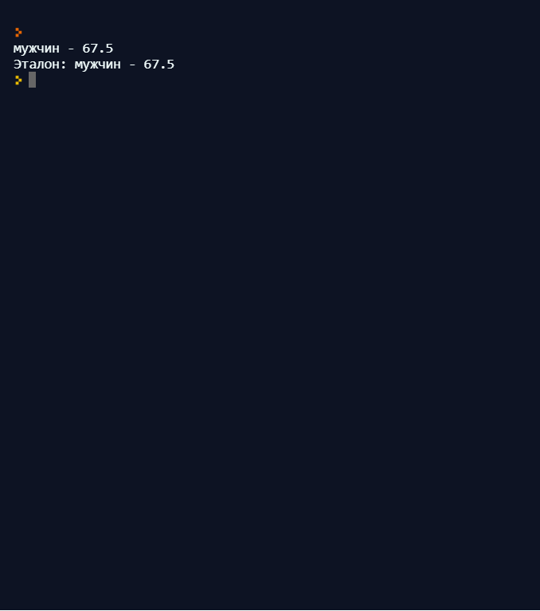

# Домашнее задание к лекции «Общаемся с компьютером»

По ходу нашего курса мы будем дорабатывать мотивационное веб-приложение, в котором пользователь может рассчитать сколько недель он прожил со дня его рождения до сегодняшнего дня. 

Вы можете открыть проект по [ссылке](https://repl.it/@netologySD/SD-diploma) и изучить его. 

В данный момент приложение работает некорректно. Нам с вами предстоит внести в него правки так, чтобы оно заработало правильно. В конце курса у вас получится полностью рабочее приложение, которым вы сможете поделиться со своими друзьями или опубликовать ссылку на него в социальных сетях. 

## Описание задания
На второй лекции вы изучили строки, узнали о способе склейки строк, научились выводить в консоль данные, а так же форматировать код. 

Давайте отработаем полученные навыки. 

В данный момент неправильно работает функция отображения среднего возраста и пола. Чтобы её исправить, нужно правильно выбрать переменные и присвоить им подходящие значения. Чтобы проверить себя, попробуйте вывести в консоль сведения о среднем возрасте и поле, разделив их тире. Также вам предстоит отформатировать код согласно [имеющемуся кодстайлу](https://github.com/netology-code/codestyle/tree/master/js).

### Перед работой
1. Откройте проект по [ссылке](https://repl.it/@netologySD/SD-diploma).
2. Нажмите кнопку `Fork`.


3. Скопируйте содержимое файла `hw-1.js` из вашей предыдущей работы в новый проект. Ссылки на предыдущие домашние задания можно найти в личном кабинете на сайте Нетологии.

4. В списке файлов слева найдите файл с именем `hw-2.js` и кликните на него.


5. В открывшемся файле внимательно прочитайте комментарии к коду — серые строки после символов `//` и между символами `/* */`.


## Задача №1
1. Найдите строчки кода, требующие форматирования, и отформатируйте код так, чтобы его стало удобно читать.

## Задача №2
1. Мы создали две переменные:
```javascript
let middleAge; 
let genderName;
```
Ваша задача — определить, какие значения присвоить каждой из них. 
2. На месте коментария:
```javascript
/*
  3. Присвойте переменной среднего возраста значение 77.6 - средний возраст для женщин
  4. Присвойте переменной названия пола строку 'женщин'
*/
```
напишите присваивание переменным `middleAge` и `genderName`, подходящие по смыслу значения из коментариев (77.6 и 'женщин').
3. Аналогично на месте коментария:
```javascript
/*
 5. Присвойте переменной среднего возраста значение 67.5 - средний возраст для мужчин
 6. Присвойте переменной названия пола строку 'мужчин'
*/
```
напишите присваивание переменным `middleAge` и `genderName`, подходящие по смыслу значения из коментариев (67.5 и 'мужчин').

## Задача №3
1. Создайте переменную `testGenderNameAndMiddleAge`
2. Присвойте переменной результат склейки переменных  `middleAge`, `genderName`, используйте тире в качестве разделителя (для склейки используйте оператор `+` )
3. Выведите в консоль переменную `testGenderNameAndMiddleAge`

Теперь вычисления должны быть правильными. Проверим это!
1. Нажмите на кнопку `Run`.


2. В правой части окна появится наше веб-приложение. 
3. Выберите пол `М` и нажмите кнопку `Заполнить таблицу`.
4. Если все задания выполнены верно, то надпись рядом с таблицей будет выглядеть так:


5. Перейдите на вкладку консоль (для этого кликните на кнопку console над правой частью окна - там, где сейчас отображается веб-приложение) — Вы увидите два сообщения, напечатанных функцией `console.log()`. Сравните свой результат с эталонным (начинается с надписи "Эталон")


